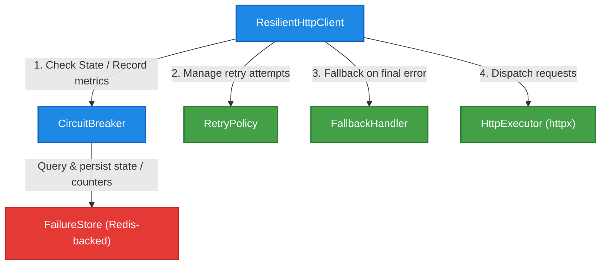
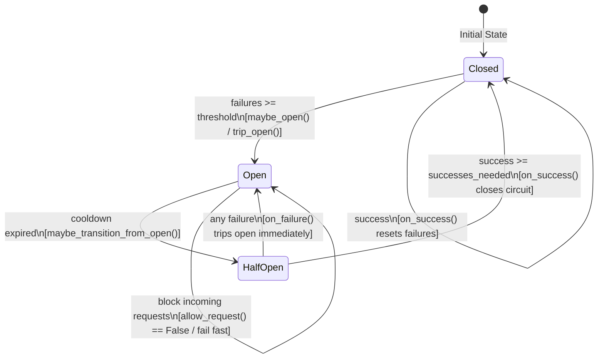

# 🛡️ Resilient HTTP Client

A production-grade, distributed-resilient HTTP client for Python, engineered to tolerate downstream service outages, network flickers, and latency spikes. It implements standard stability patterns—**Circuit Breaker**, **Retry Policies**, **Fallback Mechanisms**, and a **Redis-backed Distributed Failure Store**—enabling robust service-to-service communication.

---

## 🚀 Core Features

- **Circuit Breaker Pattern**: Seamlessly isolates degrading services using a strict state machine (`CLOSED`, `OPEN`, `HALF-OPEN`) to prevent cascading failures.
- **Distributed Failure Store**: Uses Redis as a shared backend. Multiple application workers share failure states and rolling windows, which is perfect for Kubernetes or multi-instance deployments.
- **Smart Retries with Backoff**: Configurable retry budgets to absorb transient errors without hammering upstream servers.
- **Graceful Fallbacks**: Decouples failure from user experience by returning degraded/cached responses rather than raising raw errors.
- **Async Execution**: Powered by `httpx` for high-concurrency performance.

---

## 📐 System Architecture

The following diagram illustrates how the components of `resilient-http-client` coordinate request delivery, state checking, and error fallback.



---

## 🔄 Circuit Breaker State Machine

The client enforces a fully-compliant circuit breaker state machine, supporting lazy cooldown transitions and probe request gates:



### State Transitions & Flows

- **CLOSED**: Requests flow normally. Any successful request resets the failure counter to 0. If failures cross the threshold, the circuit transitions to **OPEN**.
- **OPEN**: Incoming requests are blocked instantly (fail fast), preventing latency build-up. After the `cooldown` period expires, the circuit lazily moves to **HALF-OPEN** on the next incoming request.
- **HALF-OPEN**: Allows a limited number of probe requests (`half_open_max_calls`).
  - **Success**: If probe requests succeed `half_open_successes_needed` times, the circuit resets and returns to **CLOSED**.
  - **Failure**: Any failure in the half-open state immediately trips the circuit back to **OPEN** (fail-fast behavior).

---

## 🛠️ File Structure

The project has been refactored into focused, decoupled modules:

- 🛰️ [src/client.py](file:///home/angelo/projects/resilient-http-client/src/client.py) — The main orchestrator connecting client requests, retries, circuits, and fallbacks.
- 🔌 [src/circuit_breaker.py](file:///home/angelo/projects/resilient-http-client/src/circuit_breaker.py) — The core circuit state machine implementing state logic and thresholds.
- 🗄️ [src/failure_store.py](file:///home/angelo/projects/resilient-http-client/src/failure_store.py) — The Redis-backed client that shares failures and states across multiple workers.
- 🔁 [src/retry.py](file:///home/angelo/projects/resilient-http-client/src/retry.py) — Manages retry intervals and budgets.
- 🎭 [src/fallback.py](file:///home/angelo/projects/resilient-http-client/src/fallback.py) — Clean fallbacks returning gracefully degraded responses.
- ⚙️ [src/types.py](file:///home/angelo/projects/resilient-http-client/src/types.py) — Strong type definitions and Enums for circuit breaker states.
- 🧪 [tests/test_circuit_breaker.py](file:///home/angelo/projects/resilient-http-client/tests/test_circuit_breaker.py) — Rigorous test suite validating every state transition, probe gating, and failure window.

---

## 💻 Usage Example

Here is how you instantiate and execute requests with the `ResilientHttpClient`:

```python
import asyncio
from redis import asyncio as aioredis
from src.client import ResilientHttpClient
from src.failure_store import FailureStore

async def main():
    # 1. Instantiate the Redis connection
    redis_conn = aioredis.from_url("redis://localhost:6379")
    
    # 2. Instantiate the Failure Store for a specific service
    store = FailureStore(redis=redis_conn, service="stripe_payment")
    
    # 3. Instantiate the Resilient HTTP Client
    client = ResilientHttpClient(service="stripe_payment", store=store)
    
    # 4. Perform a highly resilient HTTP call
    try:
        response_data = await client.request(
            method="POST",
            url="https://api.stripe.com/v1/charges",
            json={"amount": 2000, "currency": "usd"}
        )
        print("Success payload:", response_data)
    except Exception as e:
        print("Final failure caught:", str(e))
    finally:
        # 5. Clean up connections
        await client.close()

if __name__ == "__main__":
    asyncio.run(main())
```

---

## ⚙️ Configuration Reference

The client holds robust sensible defaults from [src/config.py](file:///home/angelo/projects/resilient-http-client/src/config.py) but can be easily tuned:

| Parameter | Type | Default | Description |
| :--- | :--- | :--- | :--- |
| `threshold` | `int` | `5` | The number of consecutive failures before tripping the circuit. |
| `cooldown` | `int` | `30` | Time in seconds before an `OPEN` circuit transitions to `HALF-OPEN`. |
| `half_open_max_calls` | `int` | `1` | Maximum probe requests allowed while checking health in `HALF-OPEN`. |
| `half_open_successes_needed`| `int` | `1` | Successes needed in `HALF-OPEN` to close the circuit. |
| `timeout` | `float` | `5.0` | Default timeout for httpx execution. |

---

## 🧪 Running the Tests

Ensure you have your environment set up and execute the pytest suite:

```bash
# Verify all transitions, retries, store structures, and fallbacks
PYTHONPATH=. uv run pytest tests
```

### Test Coverage Breakdown

The unit and integration tests validate the following:
1. **Failure Tracking**: Asserting failure counters increment accurately on exception loops.
2. **Threshold Violations**: Verifying that the circuit trips open exactly when reaching the threshold and remains closed beforehand.
3. **Lazy Cooldown Transition**: Assuring an open circuit correctly progresses to `half-open` once cooldown times out.
4. **Half-Open Gates**: Guaranteeing probe request limits and immediate fail-back to `open` upon any probe failure.
5. **Fallback Routing**: Confirming degraded payloads are gracefully routed.
