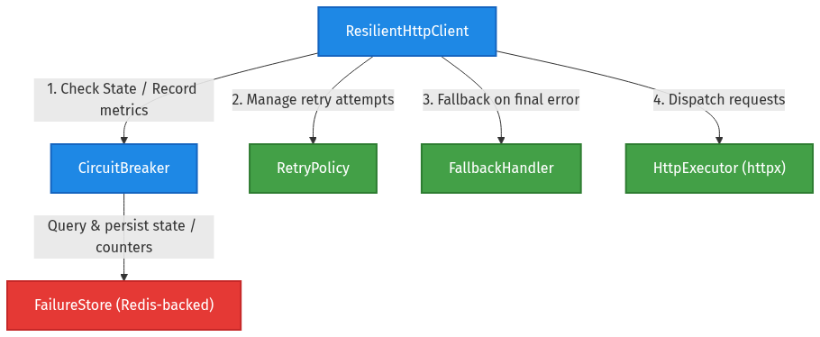

# 📐 System Architecture

The `resilient-http-client` is an asynchronous, production-grade HTTP client library engineered for high resilience, fault tolerance, and distributed state coordination in Python microservices.



---

## 🏗️ Core Layers

The library is organized into six clean architectural layers:

```text
┌─────────────────────────────────────────────────────────────────┐
│                      Application Code                           │
└────────────────────────────────┬────────────────────────────────┘
                                 │
┌────────────────────────────────▼────────────────────────────────┐
│                   ResilientHttpClient                           │
│  (Orchestrator: request routing, per-request overrides, context)│
└───────────────┬─────────────────┬─────────────────┬─────────────┘
                │                 │                 │
┌───────────────▼────────┐ ┌──────▼────────┐ ┌──────▼────────────┐
│     CircuitBreaker     │ │  RetryPolicy  │ │  FallbackHandler  │
│ (State Machine Engine) │ │ (Exponential) │ │ (Degraded Modes)  │
└───────────────┬────────┘ └──────────────┘ └───────────────────┘
                │
┌───────────────▼────────┐
│      FailureStore      │
│ (Redis State Backend)  │
└────────────────────────┘
```

### 1. Client Orchestration Layer (`client.py`)
`ResilientHttpClient` is the primary entry point. It manages context lifecycles (`async with`), coordinates requests across the circuit breaker, retry policy, and fallback handler, and resolves per-request overrides (`max_retries`, `timeout`, `fallback`, `ignore_circuit`).

### 2. Circuit Breaker Engine (`circuit_breaker.py`)
Implements the Resilience4j-compliant Circuit Breaker state machine (`CLOSED`, `OPEN`, `HALF-OPEN`). Evaluates failure counts and sliding window statistics (`COUNT_BASED` and `TIME_BASED`) to determine whether downstream calls should proceed or fast-fail.

### 3. Distributed Failure Store (`failure_store.py`)
Acts as the single source of truth for circuit state and metric counters across distributed service replicas using Redis. Uses atomic Redis transactions (`SETNX`, pipelines, atomic increments) to guarantee thread safety and prevent stampedes during state recovery.

### 4. Exponential Retry Engine (`retry.py`)
Calculates exponential backoff delays with configurable base delays and caps. Controls retry attempts based on HTTP status codes and transient network exceptions.

### 5. Fallback Handler (`fallback.py`)
Executes registered sync/async fallback callbacks when circuit breakers are open, retries are exhausted, or unhandled errors occur.

### 6. Pluggable Protocol Interfaces (`protocols/`)
All major subsystems implement Python `@runtime_checkable` `Protocol` contracts:
- [`FailureStoreProtocol`](file:///home/angelo/projects/resilient-http-client/src/resilient_http_client/protocols/failure_store_protocol.py)
- [`HttpExecutorProtocol`](file:///home/angelo/projects/resilient-http-client/src/resilient_http_client/protocols/http_executor_protocol.py)
- [`RetryPolicyProtocol`](file:///home/angelo/projects/resilient-http-client/src/resilient_http_client/protocols/retry_policy_protocol.py)
- [`FallbackHandlerProtocol`](file:///home/angelo/projects/resilient-http-client/src/resilient_http_client/protocols/fallback_handler_protocol.py)

---

## ⚡ Data & Control Flow

1. **Request Reception**: Application calls `client.request(method, url, **kwargs)`.
2. **Circuit Check**: `CircuitBreaker.allow_request()` queries `FailureStore`. If `OPEN`, fast-fails and invokes `FallbackHandler`.
3. **Execution**: If `CLOSED` or `HALF-OPEN` probe token is acquired, request is dispatched through `HttpExecutor`.
4. **Outcome Evaluation**:
   - **Success (2xx/3xx)**: Notifies `CircuitBreaker.on_success()`, resetting failure counters and closing the circuit if in `HALF-OPEN`.
   - **Retryable Failure**: Evaluates `RetryPolicy`. If attempts remain, sleeps via `await retry.wait(attempt)` and retries.
   - **Circuit Failure**: Increments failure counter via `FailureStore`. Trips state to `OPEN` if threshold/rate limit is reached.
