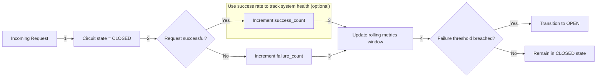

```mermaid
flowchart LR

    R["Incoming Request"]

    R -->|"1"| A["Circuit state = CLOSED"]

    
    A -->|"2"| C{"Request successful?"}
    
    C -->|"Yes"| D["Increment success_count"]

    C -->|"No"| E["Increment failure_count"]

    D -->|"3"| F["Update rolling metrics window"]

    subgraph one["Use success rate to track system health (optional)"]
        D
    end

    E -->|"3"| F["Update rolling metrics window"]

    F -->|"4"| G{"Failure threshold breached?"}

    G -->|"Yes"| H["Transition to OPEN"]

    G -->|"No"| J["Remain in CLOSED state"]
```