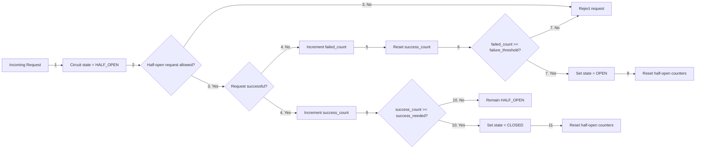

```mermaid
flowchart LR
    R["Incoming Request"]

    R -->|"1"| A["Circuit state = HALF_OPEN"]

    A -->|"2"| B{"Half-open request allowed?"}

    B -->|"3. Yes"| C{"Request successful?"}
    B -->|"3. No"| D["Reject request"]

    C -->|"4. No"| E["Increment failed_count"]
    E -->|"5"| F["Reset success_count"]

    F -->|"6"| G{"failed_count >= failure_threshold?"}

    G -->|"7. Yes"| H["Set state = OPEN"]
    H -->|"8"| I["Reset half-open counters"]

    G -->|"7. No"| D

    C -->|"4. Yes"| J["Increment success_count"]

    J -->|"9"| K{"success_count >= success_needed?"}

    K -->|"10. Yes"| L["Set state = CLOSED"]
    L -->|"11"| M["Reset half-open counters"]

    K -->|"10. No"| N["Remain HALF_OPEN"]
```