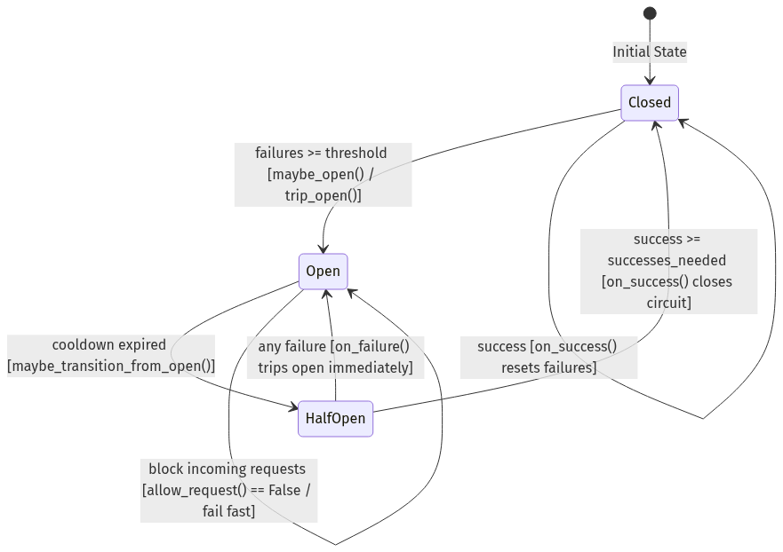

# 🔄 State Machine Formal Specification

The circuit breaker enforces strict state transition invariants across three primary states: `CLOSED`, `OPEN`, and `HALF-OPEN`.



---

## 🚦 Formal State Matrix

```text
               ┌───────────┐
               │  CLOSED   │◄────────────────┐
               └─────┬─────┘                 │
                     │                       │
      Failure Rate   │                       │ Probe Successes
       >= Threshold  │                       │ Met
                     ▼                       │
               ┌───────────┐                 │
               │   OPEN    │                 │
               └─────┬─────┘                 │
                     │                       │
     Cooldown Expired│                       │
     + SETNX Lock    ▼                       │
               ┌───────────┐                 │
               │ HALF-OPEN ├─────────────────┘
               └─────┬─────┘
                     │
                     │ Probe Failure
                     ▼
               (Back to OPEN)
```

### 1. CLOSED State
- **Invariant**: All requests are allowed to reach the downstream HTTP service.
- **On Success**: Calls `store.reset_failures()` and `store.record_call(success=True)`.
- **On Failure**: Calls `store.increment_failures()` and `store.record_call(success=False)`.
- **Transition**: If failure count $\ge$ `failure_threshold` or sliding window failure percentage $\ge$ `failure_rate_threshold`, transitions state to `OPEN`.

### 2. OPEN State
- **Invariant**: Requests immediately fail and return fallbacks without contacting the downstream HTTP service.
- **Expiry**: Checks `open_until` timestamp persisted in Redis.
- **Transition**: When current timestamp $> \text{open\_until}$, state transitions to `HALF-OPEN`.

### 3. HALF-OPEN State
- **Invariant**: Only `half_open_max_calls` probe requests are allowed to pass through using atomic `SETNX` probe token locks.
- **On Probe Success**: Increments probe success count. If successes $\ge$ `half_open_successes_needed`, transitions to `CLOSED`.
- **On Probe Failure**: Instantly transitions back to `OPEN` and resets the cooldown timer.
